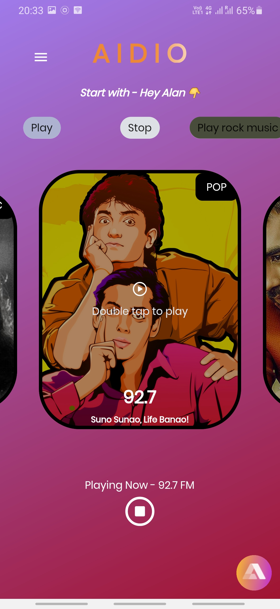
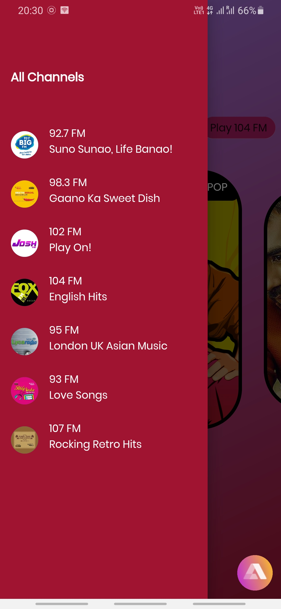
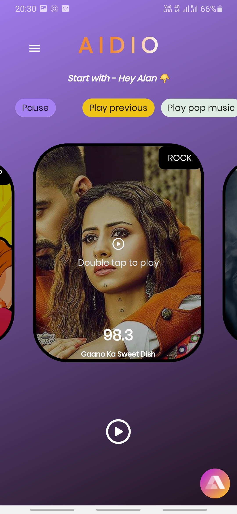
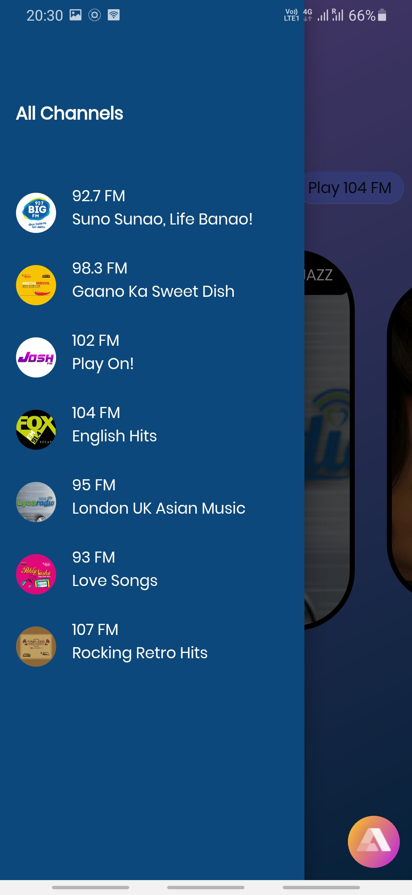
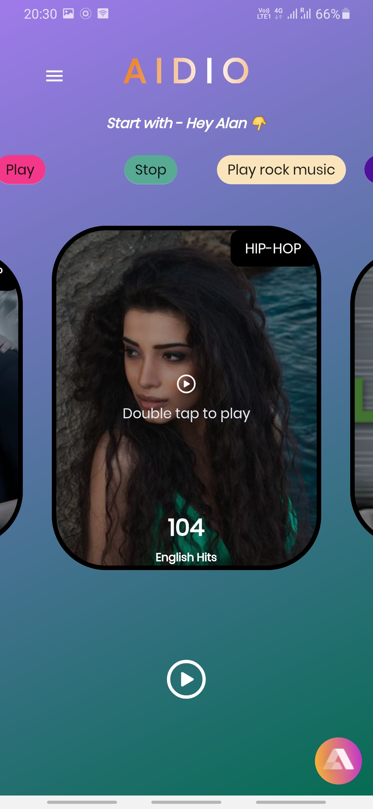
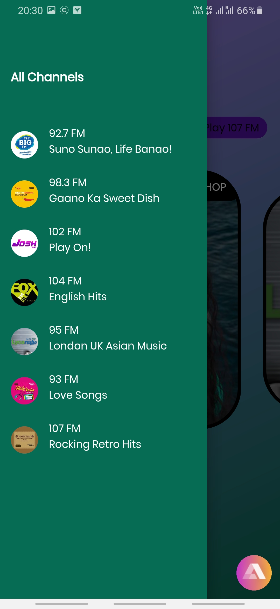
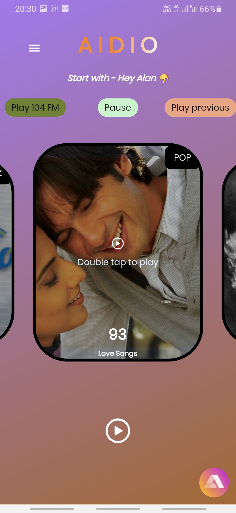
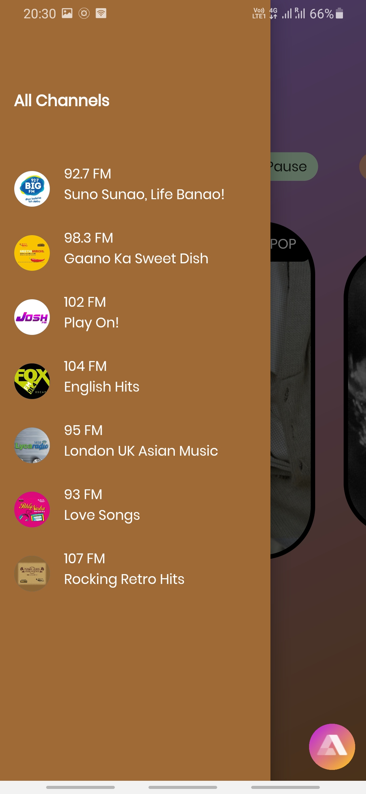
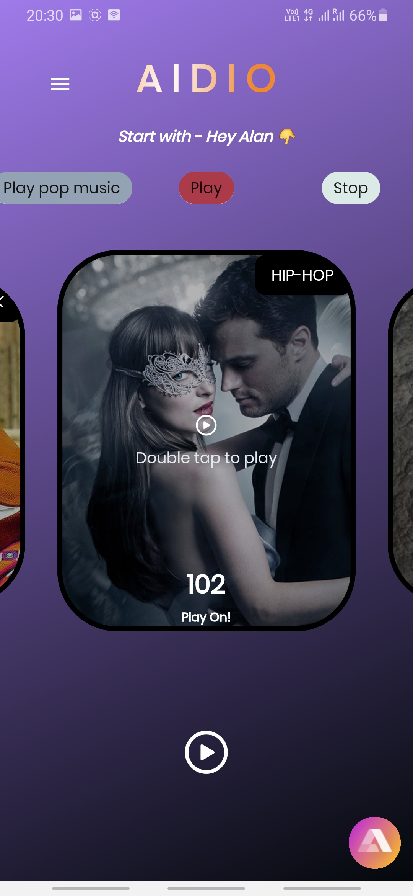
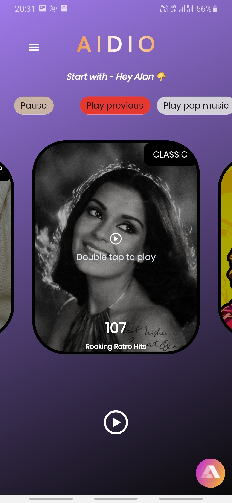

# :notes::speech_balloon: AIDIO

AI-powered Voice Controlled Radio App.

---

## :fire: Features

- Beautiful UI.
- Radio Channels and Musics of different genres, one voice command away.
- ALAN voice assistant can play next, previous, specified FM channel or specified genre of music.
- ALAN voice assistant interacts and can tell a joke, advice and entertains users by answering different questions.

---

## :bulb: Built Using

- [**FLUTTER**](https://flutter.dev/)
- [**VELOCITY X**](https://velocityx.dev/)
- [**ALAN AI**](https://alan.app/)

---

## :iphone: Screenshots

|                                      |                                      |
| ------------------------------------ | ------------------------------------ |
|  |  |
|   |   |
|   |    |
|   |    |
|   |    |

---

## :heart: Found this project interesting?

If you found this project useful, then please consider giving it a :star: on Github and sharing it with your friends via social media.

---

## :man: Project Created & Maintained By

  Utkarsh Chaurasia

